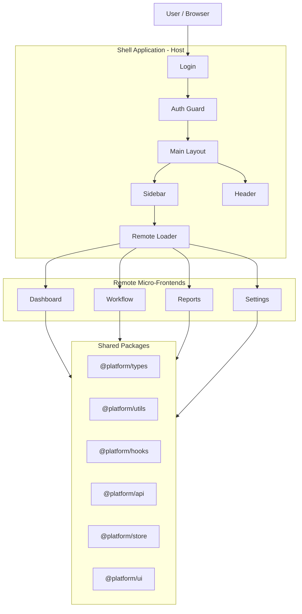
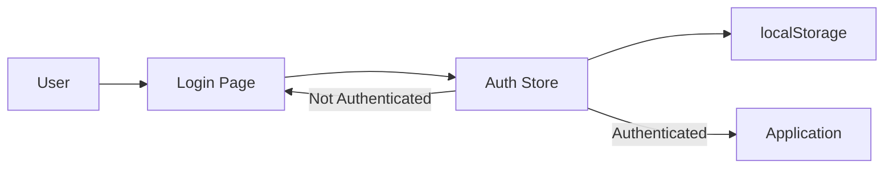
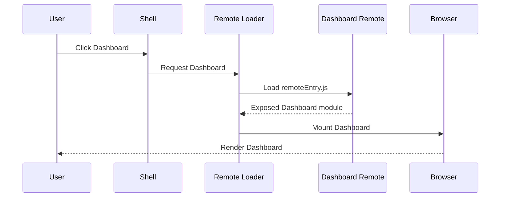
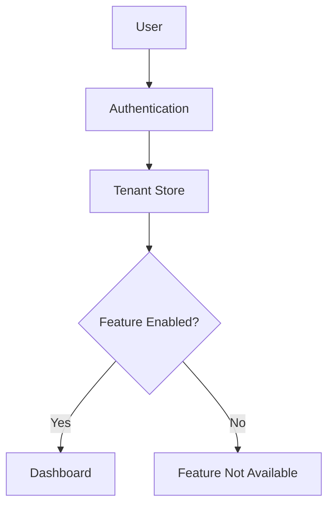
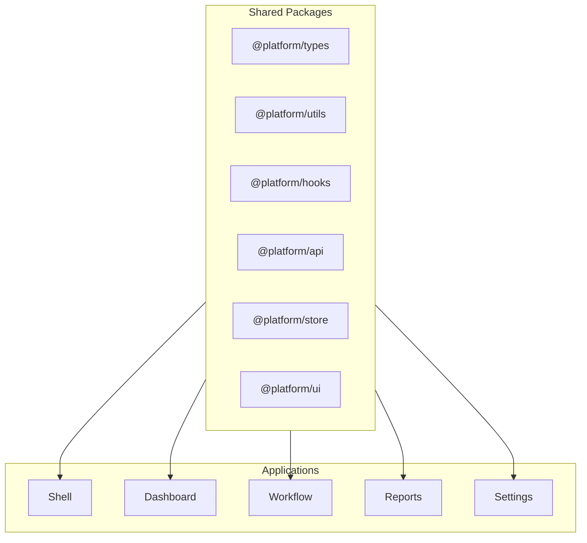
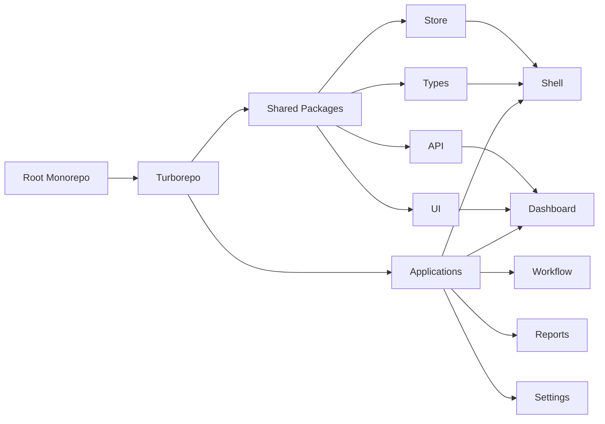

# 🚀 Micro-Frontend Platform

A production-style **Micro-Frontend SaaS platform** built with **React, TypeScript, Webpack 5 Module Federation, pnpm Workspaces, and Turborepo**.

The application is split into a **Shell/Host application** and multiple independently developed micro-frontends:

* 📊 Dashboard
* ⚙️ Workflow
* 📈 Reports
* 🛠️ Settings

The Shell provides the common application experience, authentication, layout, navigation, and remote loading, while each micro-frontend owns its own feature area.

---

## 🧠 What is this project?

Instead of building one large frontend application, this project divides the frontend into smaller independent applications that can be developed, built, and deployed separately.

```text
                    ┌───────────────────────┐
                    │       Shell App        │
                    │      Host / Portal     │
                    │                       │
                    │ Login • Header        │
                    │ Sidebar • Routing     │
                    │ Remote Loader         │
                    └───────────┬───────────┘
                                │
                    Module Federation
                                │
        ┌───────────────────────┼────────────────────────┐
        │                       │                        │
        ▼                       ▼                        ▼
┌───────────────┐       ┌───────────────┐       ┌───────────────┐
│   Dashboard   │       │    Workflow   │       │    Reports    │
│   Remote App  │       │   Remote App  │       │   Remote App  │
└───────────────┘       └───────────────┘       └───────────────┘
                                │
                                ▼
                       ┌───────────────┐
                       │    Settings   │
                       │   Remote App  │
                       └───────────────┘
```

The architecture follows the same general idea as microservices, but the decomposition happens at the **frontend application level**.

---

## ✨ Features

### 🏠 Shell Application

* Authentication screen
* Main application layout
* Sidebar navigation
* Header with user information
* Remote micro-frontend loading
* Loading states
* Remote loading error handling
* Feature-based access control
* Dark/light theme

### 📊 Dashboard

* Statistics cards
* Revenue charts
* User analytics
* Activity feed
* Area, bar, and donut charts

### ⚙️ Workflow

* Workflow listing
* Search
* Active/paused status
* Workflow controls
* Confirmation dialogs

### 📈 Reports

* Reports table
* Search and filtering
* Donut chart
* Report generation UI
* Report deletion UI
* Modal interactions

### 🛠️ Settings

* Profile settings
* Password management UI
* Theme settings
* Notification preferences
* Account danger zone

### 📦 Shared Platform Packages

The repository contains reusable packages shared across applications:

* `@platform/types`
* `@platform/utils`
* `@platform/hooks`
* `@platform/api`
* `@platform/store`
* `@platform/ui`

This avoids duplicating common logic and UI across micro-frontends.

---

## 🏗️ Architecture

The system consists of three major layers:

1. **Shell / Host**
2. **Remote Micro-Frontends**
3. **Shared Packages**



---

# 🔄 How the Application Works

## 1. User Loads the Shell

The browser initially loads the Shell application.

```text
Browser
   ↓
Shell index.html
   ↓
main bundle
   ↓
bootstrap.tsx
   ↓
React App
   ↓
Authentication Check
```

The Shell is the entry point of the entire platform.

---

## 2. Authentication

After the application starts, the Shell checks the authentication state.



The authentication store maintains information such as:

* User
* Token
* Authentication status
* Initialization state

The project uses Zustand for this global client-side state.

---

# 🧩 Module Federation

The core technology behind the architecture is **Webpack 5 Module Federation**.

Module Federation allows the Shell to load modules from another independently built application at runtime instead of bundling every micro-frontend into the Shell during its own build.

### Shell configuration concept

```text
Shell
 ├── dashboard → http://localhost:3001/remoteEntry.js
 ├── workflow  → http://localhost:3002/remoteEntry.js
 ├── reports   → http://localhost:3003/remoteEntry.js
 └── settings  → http://localhost:3004/remoteEntry.js
```

Each remote exposes an application module through its `remoteEntry.js`.

---

# 🔌 Remote Loading Flow

When the user clicks **Dashboard**:



The same mechanism is used for Workflow, Reports, and Settings.

---

# 📊 Dashboard Data Flow

```text
User
 ↓
Shell Sidebar
 ↓
Remote Loader
 ↓
Dashboard Remote
 ↓
Dashboard Page
 ↓
Dashboard API
 ↓
Backend API
 ↓
JSON Response
 ↓
Dashboard UI
```

The shared API package provides the HTTP communication layer and includes a configured Axios client.

---

# 🏢 Multi-Tenant Feature Control

The Shell includes an `AuthGuard` that can check whether a feature is enabled for the current tenant.



For example:

```text
tenant.features.reports === true
        ↓
Reports available
```

Otherwise the application can prevent access to that feature.

---

# 📦 Shared Package Architecture

The monorepo contains reusable packages that can be consumed by all micro-frontends.



### `@platform/types`

Contains shared TypeScript contracts such as:

* `User`
* `Tenant`
* `TenantFeatures`
* `RemoteConfig`
* `MenuItem`
* `AuthState`

This creates a common type contract across the applications.

### `@platform/utils`

Contains reusable utility functions:

* Currency formatting
* Date formatting
* Relative time
* String truncation
* Pluralization
* Class-name merging

### `@platform/hooks`

Contains reusable React hooks:

* `useDebounce`
* `useMediaQuery`
* `useLocalStorage`
* `useOnClickOutside`

### `@platform/api`

Centralized HTTP communication layer.

```text
React App
   ↓
@platform/api
   ↓
Axios
   ↓
Backend API
```

It also handles authentication tokens and unauthorized responses.

### `@platform/store`

Centralized client-side state management using Zustand.

Stores include:

```text
auth.store
tenant.store
theme.store
```

### `@platform/ui`

Shared design system containing reusable components such as:

* Button
* Input
* Select
* Card
* Modal
* Table
* Sidebar
* Header
* Loader
* Skeleton
* Badge
* PageHeader
* Charts
* PageTransition

This allows all micro-frontends to maintain a consistent UI.

---

# 🗂️ Project Structure

```text
mirco-frontend/
│
├── apps/
│   │
│   ├── shell/
│   │   ├── src/
│   │   │   ├── auth/
│   │   │   ├── federation/
│   │   │   ├── layouts/
│   │   │   ├── providers/
│   │   │   ├── App.tsx
│   │   │   ├── bootstrap.tsx
│   │   │   └── index.ts
│   │   └── webpack.config.js
│   │
│   ├── dashboard/
│   │   ├── src/
│   │   └── webpack.config.js
│   │
│   ├── workflow/
│   │   ├── src/
│   │   └── webpack.config.js
│   │
│   ├── reports/
│   │   ├── src/
│   │   └── webpack.config.js
│   │
│   └── settings/
│       ├── src/
│       └── webpack.config.js
│
├── packages/
│   ├── types/
│   ├── utils/
│   ├── hooks/
│   ├── api/
│   ├── store/
│   └── ui/
│
├── package.json
├── pnpm-workspace.yaml
├── turbo.json
├── tsconfig.base.json
├── tailwind.config.js
├── postcss.config.js
└── pnpm-lock.yaml
```

The repository is structured as a pnpm workspace and Turborepo monorepo, with separate `apps/` and `packages/` areas.

---

# ⚡ Build Architecture

Turborepo acts as the build orchestrator.



Turborepo coordinates tasks across the workspace and can reuse cached results when inputs have not changed.

---

# 🧑‍💻 Development Setup

## Prerequisites

* Node.js
* pnpm

Install pnpm if necessary:

```bash
npm install -g pnpm
```

## Install Dependencies

```bash
pnpm install
```

## Start All Applications

```bash
pnpm run dev
```

This starts:

| Application |   Port |
| ----------- | -----: |
| Shell       | `3000` |
| Dashboard   | `3001` |
| Workflow    | `3002` |
| Reports     | `3003` |
| Settings    | `3004` |

These ports and the root development workflow are documented in the project summary.

Open:

```text
http://localhost:3000
```

---

## Start Individual Applications

```bash
pnpm run dev:shell
```

or:

```bash
pnpm run dev:dashboard
```

Individual workspaces can also be targeted with pnpm filters.

---

# 🏗️ Production Build

Build the entire monorepo:

```bash
pnpm run build
```

Turborepo coordinates package/application builds according to their dependencies.

---

# 🔄 Complete System Flow

```text
                         USER
                           │
                           ▼
                  ┌────────────────┐
                  │  Shell / Host  │
                  │   Port 3000    │
                  └───────┬────────┘
                          │
                   Authentication
                          │
                          ▼
                  ┌────────────────┐
                  │   Main Layout  │
                  │ Sidebar/Header │
                  └───────┬────────┘
                          │
                    User selects
                       feature
                          │
                          ▼
                ┌────────────────────┐
                │   Remote Loader    │
                └─────────┬──────────┘
                          │
                  Module Federation
                          │
        ┌─────────────────┼──────────────────┐
        │                 │                  │
        ▼                 ▼                  ▼
   Dashboard          Workflow           Reports
   Port 3001          Port 3002          Port 3003
        │                 │                  │
        └─────────────────┼──────────────────┘
                          │
                          ▼
                    Settings
                    Port 3004

                          │
                          ▼
                ┌────────────────────┐
                │ Shared Packages    │
                │ Types / UI / API   │
                │ Store / Hooks      │
                └─────────┬──────────┘
                          │
                          ▼
                    Backend APIs
```

---

# 🎯 Why Micro-Frontends?

A traditional frontend could place Dashboard, Reports, Settings, and Workflow inside one large application.

This project instead separates them into independently managed applications.

### Benefits

* **Independent development** — teams can work on different applications.
* **Independent builds** — each remote has its own build.
* **Runtime loading** — the Shell can load a remote when required.
* **Code ownership** — feature boundaries are clearer.
* **Shared contracts** — TypeScript types maintain consistency.
* **Shared UI** — common components prevent visual duplication.
* **Scalability** — additional micro-frontends can be added without turning the Shell into one large codebase.

### Trade-offs

Micro-frontends are not automatically better than a monolith.

They introduce additional complexity:

* Multiple build configurations
* Runtime remote loading
* Shared dependency management
* Version compatibility
* Deployment coordination
* More difficult debugging
* Cross-application state management

The architecture becomes valuable when the application or organization is large enough to benefit from independent feature ownership and deployment.

---

# 🧠 Key Concepts Demonstrated

| Concept                 | Implementation                                          |
| ----------------------- | ------------------------------------------------------- |
| **Micro-Frontend**      | Independent Dashboard, Workflow, Reports, Settings apps |
| **Module Federation**   | Runtime loading of remote applications                  |
| **Host / Shell**        | Central application responsible for composition         |
| **Monorepo**            | pnpm Workspaces                                         |
| **Build Orchestration** | Turborepo                                               |
| **State Management**    | Zustand                                                 |
| **API Layer**           | Axios                                                   |
| **Type Safety**         | TypeScript                                              |
| **Shared Components**   | `@platform/ui`                                          |
| **Shared Contracts**    | `@platform/types`                                       |
| **Reusable Logic**      | `@platform/hooks`, `@platform/utils`                    |
| **Feature Flags**       | Tenant-based feature configuration                      |
| **Styling**             | Tailwind CSS                                            |
| **Charts**              | Recharts                                                |

---

